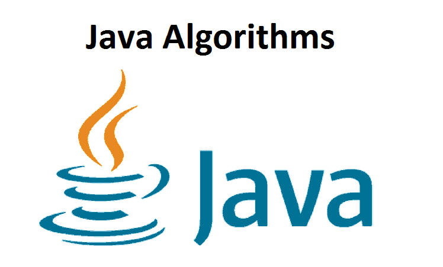

<p align="center"></p>

# Java : Algorithms
All the Algorithms are implemented in java.
This is a collection of all the basic and advance Algorithms I am implementing for my educational purpose. The code is optimized and is written to be correct and readable. All the algorithms are tested and, believed to be correct.

## Tests

### Compile
for compiling the program write down:
```
	javac file_name.java
```

### Run
to run the program write down:
```
	java file_name
```

# What's been implemented:

## Table of Contents

- Algorithms
- Notes

## List Of Algorithms and Implementations

- Searching Algorithms
	- Linear Search
		- Last Occurrence
	- Binary Search
		- Iterative Method
		- Recursive Method
	- Ternary Search

- Sorting Algorithms
	- Bubble Sort
	- Selection Sort
	- Insertion Sort
	- Quick Sort
	- Merge Sort
		- Inversion Count Problem


<p align="center">😊</p>